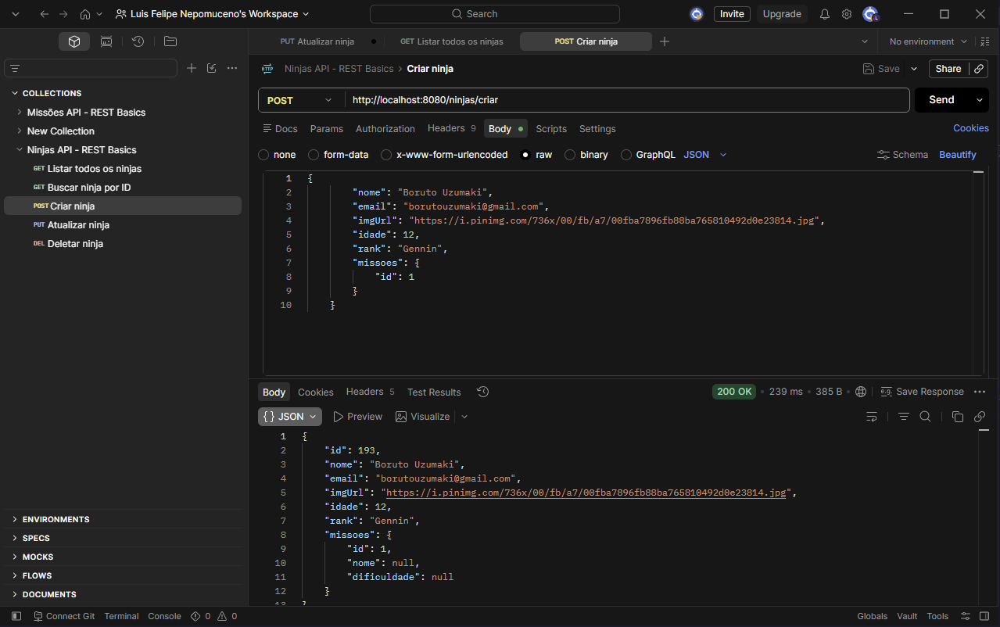

# 🥷 Cadastro de Ninjas — API REST

API REST para gerenciamento de ninjas e missões, desenvolvida com **Java 17** e **Spring Boot 4**, estruturada em arquitetura de camadas (Controller → Service → Repository) com persistência via JPA e versionamento de banco com Flyway.

> O módulo de **Missões** (entidade, repository, service, controller e relacionamento com Ninjas) foi projetado e implementado de forma autônoma, estendendo a arquitetura base do projeto.



---

## Funcionalidades

- CRUD completo de **Ninjas** (nome, idade, e-mail, imagem, rank)
- CRUD completo de **Missões** (nome, dificuldade)
- Associação de ninjas a missões (relacionamento `@ManyToOne` / `@OneToMany`)
- Transferência de dados via **DTOs** com mapeamento dedicado (Mapper)
- Respostas HTTP semânticas com **ResponseEntity** (200, 201, 404...)
- Migrações de banco versionadas com **Flyway**

## Endpoints

### Ninjas

| Método | Rota                    | Descrição                    |
|--------|-------------------------|------------------------------|
| GET    | `/ninjas/boasvindas`    | Mensagem de boas-vindas      |
| GET    | `/ninjas/listar`        | Lista todos os ninjas        |
| GET    | `/ninjas/listar/{id}`   | Busca ninja por ID           |
| POST   | `/ninjas/criar`         | Cria um novo ninja           |
| PUT    | `/ninjas/alterar/{id}`  | Atualiza um ninja existente  |
| DELETE | `/ninjas/deletar/{id}`  | Remove um ninja              |

### Missões

| Método | Rota                     | Descrição                     |
|--------|--------------------------|-------------------------------|
| GET    | `/missoes/listar`        | Lista todas as missões        |
| GET    | `/missoes/listar/{id}`   | Busca missão por ID           |
| POST   | `/missoes/criar`         | Cria uma nova missão          |
| PUT    | `/missoes/alterar/{id}`  | Atualiza uma missão existente |
| DELETE | `/missoes/deletar/{id}`  | Remove uma missão             |

## Modelagem

```
┌──────────────┐         ┌──────────────┐
│    Ninja     │ N     1 │    Missao    │
│──────────────│ ───────▶│──────────────│
│ id           │         │ id           │
│ nome         │         │ nome         │
│ idade        │         │ dificuldade  │
│ email        │         │              │
│ imgUrl       │         │              │
│ rank         │         │              │
└──────────────┘         └──────────────┘
```

Modelagem simplificada por design: cada ninja possui **uma missão ativa**; uma missão pode ser atribuída a **vários ninjas**.

## Stack

| Camada          | Tecnologia                         |
|-----------------|------------------------------------|
| Linguagem       | Java 17                            |
| Framework       | Spring Boot 4.x (Web, Data JPA)    |
| Banco de dados  | H2 (dev) · migrações com Flyway    |
| Build           | Maven                              |
| Produtividade   | Lombok                             |
| Versionamento   | Git · GitHub (issues + milestones) |

## Como executar

Pré-requisitos: **Java 17** e **Maven** instalados.

```bash
# Clone o repositório
git clone https://github.com/LuisFelipeTS17/CadastroDeNinjas.git
cd CadastroDeNinjas

# Compile e execute
mvn clean install
mvn spring-boot:run
```

A aplicação sobe em `http://localhost:8080`.
Console do H2 disponível em `http://localhost:8080/h2-console`.

## Organização do desenvolvimento

- Commits seguindo **Conventional Commits**
- Fluxo de branches por feature (`feature/T-0001-criar-mapper-dto`)
- Tarefas rastreadas com **GitHub Issues** e **Milestones**

---

**Luis Felipe Nepomuceno** · [LinkedIn](https://linkedin.com/in/luisfnepomuceno) · [GitHub](https://github.com/LuisFelipeTS17)